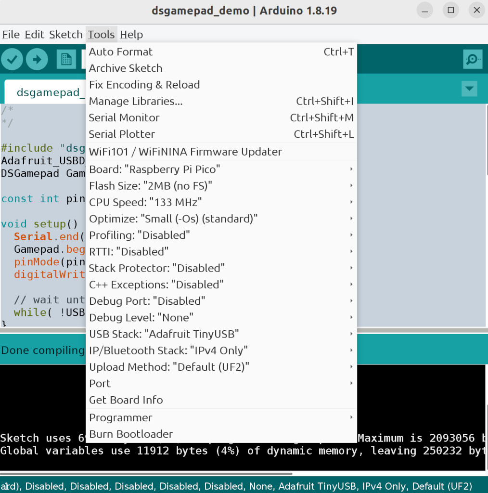

# DS Gamepad

Create a generic USB Gamepad using the Adafruit TinyUSB library. The gamepad
has some of the capabilities of a DualShock 4 gamepad but is not compatible
with PlayStation consoles. DS gamepad does not support rumble motors or motion
controls.

